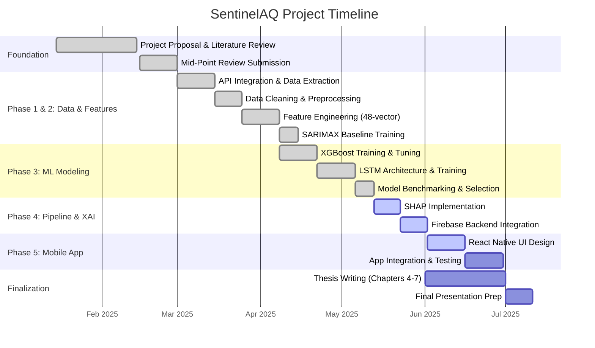

# CHAPTER 3: METHODOLOGY

## 3.1 Chapter Overview
This chapter delineates the research methodology and development framework employed to design, develop, and evaluate the SentinelAQ predictive system. The methodology is structurally aligned with Saunders' Research Onion to provide a rigorous philosophical and practical foundation for the study. Section 3.2 unpacks the theoretical research framework, justifying the philosophical stance and strategic approach. Section 3.3 outlines the Agile development methodology utilized for system implementation. Section 3.4 details the project management lifecycle, including a comprehensive Gantt chart, phase deliverables, and resource requirements. Section 3.5 presents a critical risk analysis and mitigation strategy. Finally, Section 3.6 details the quantitative evaluation design, specifying the metrics used to benchmark model accuracy and interpretability.

## 3.2 Research Methodology Framework (Saunders' Research Onion)
To ensure academic rigor and coherence, this research systematically addresses the layers of Saunders' Research Onion (Saunders et al., 2019), tailoring each methodological choice to specifically address the research aim of forecasting and interpreting PM2.5 variations in Sri Lanka.

### 3.2.1 Research Philosophy: Positivism
**Choice & Justification:** This study adopts a **Positivist** philosophy. Positivism relies on observable, quantifiable, and empirical data to generate statistically verifiable outcomes. Because this research aims to forecast atmospheric pollutant concentrations using mathematical algorithms (XGBoost, LSTM, SARIMAX) applied to objective sensor telemetry (PM2.5, temperature, humidity), it operates under the assumption of an objective, measurable reality. This stance perfectly aligns with Research Objective 4 (evaluating model accuracy via RMSE/MAE), as it requires a strictly quantitative, value-free interpretation of data rather than subjective human interpretation.

### 3.2.2 Research Approach: Deductive
**Choice & Justification:** A **Deductive** approach is utilized. Deductive research begins with existing theories and formulates hypotheses to be tested empirically. Based on the literature review (Chapter 2), the study deduced the hypothesis that tree-based ensemble models (XGBoost) configured with tabular lag features would outperform sequential deep learning models (LSTM) in short-to-medium horizon environmental forecasting. The research design is structured explicitly to test this deduction through rigorous algorithmic benchmarking across 1 to 48-hour horizons.

### 3.2.3 Research Strategy: Design Science Research (DSR) & Experimentation
**Choice & Justification:** The strategy is a hybrid of **Design Science Research (DSR)** and **Experimentation**. DSR focuses on creating novel, practical artifacts to solve specific problems—in this case, the design and development of the SentinelAQ automated pipeline and mobile application (Objective 7). Concurrently, an Experimental strategy is employed within the machine learning phase (Objectives 3 & 4), where variables are controlled (e.g., standardizing the 48-feature vector across all models) to benchmark competing algorithms against a statistical baseline (SARIMAX).

### 3.2.4 Time Horizon: Longitudinal
**Choice & Justification:** A **Longitudinal** time horizon is required. Air quality is inherently cyclical, heavily influenced by seasonal monsoons, daily traffic patterns, and annual temperature shifts. To capture these non-linear temporal dynamics, the dataset must span a continuous, multi-year period. Consequently, data was collected longitudinally from January 2022 to December 2025, allowing the models to learn long-term seasonal dependencies and short-term diurnal spikes.

### 3.2.5 Data Collection and Analysis Techniques
**Choice & Justification:** The research employs **Quantitative Data Collection and Analysis**. It must be explicitly noted that the primary research methodology for this study is entirely empirical; no qualitative user interviews or surveys were conducted. Instead, primary data is programmatically collected via Application Programming Interfaces (APIs)—specifically the PurpleAir REST API for historical PM2.5 ground truth and the Open-Meteo API for localized weather proxies. The analysis technique involves supervised machine learning regression, statistically evaluated using error metrics, and mathematically interpreted using cooperative game theory (SHAP).

## 3.3 System Development Methodology
To manage the complexities of data engineering, algorithmic tuning, and full-stack software development, an **Agile (Iterative Prototyping)** methodology was adopted. 

**Justification:** Traditional Waterfall methodologies are too rigid for machine learning projects, where data quality issues or model underperformance often necessitate revisiting earlier stages. Agile allows for iterative cycles (Sprints). For instance, when initial deep learning models failed to capture 48-hour trends accurately, the Agile framework permitted a "step back" to the feature engineering phase to introduce 24-hour rolling statistical means, rapidly testing the new vector on XGBoost in the subsequent sprint.

### 3.3.1 Development Sprints
The project was divided into five core iterative phases:
1. **Phase 1 (Data Acquisition & Preprocessing):** Automating API extraction, handling missing values, and chronologically aligning PurpleAir (dependent variable) and Open-Meteo (independent variables) datasets for Colombo and Kandy.
2. **Phase 2 (Feature Engineering & Baseline):** Constructing the 48-dimensional feature vector (lags, rolling means, cyclical encoding) and establishing the statistical forecasting baseline using SARIMAX.
3. **Phase 3 (Advanced Modeling & Optimization):** Iteratively training, tuning, and cross-validating the XGBoost and LSTM architectures.
4. **Phase 4 (Explainability & Inference Pipeline):** Implementing the SHAP TreeExplainer for the optimal model and wrapping the inference logic into an automated Python backend connected to Firebase.
5. **Phase 5 (Application Development):** Building the React Native mobile front-end to visualize the Firebase payload (AQI dials, SHAP insights, push notifications).

## 3.4 Project Management and Timeline

### 3.4.1 Gantt Chart
The following Mermaid diagram outlines the project timeline, showcasing major phases, milestones, and dependencies.

### 3.4.2 Project Deliverables
* **Phase 1/2:** Cleaned, synchronized CSV datasets for Colombo and Kandy; Engineered 48-feature training matrices.
* **Phase 3:** Trained model artifacts (`.pkl`, `.h5`); CSV files containing comprehensive RMSE/MAE metrics across all horizons.
* **Phase 4:** Automated Python inference script; Active Firebase Firestore database populated with real-time predictions; SHAP summary visualizations.
* **Phase 5:** Functioning React Native mobile application (SentinelAQ) deployed on an emulator/device.
* **Final:** Bound Thesis Report and Presentation Slide Deck.

### 3.4.3 Resource Requirements
* **Hardware:** A local development workstation with sufficient RAM (16GB+) and a multi-core CPU for parallel processing of XGBoost trees and LSTM matrix multiplications.
* **Software/Languages:** Python 3.11+ (Data Science Backend), JavaScript/React Native (Mobile Frontend).
* **Libraries:** `scikit-learn`, `xgboost`, `tensorflow`/`keras`, `statsmodels`, `shap`, `pandas`, `numpy`, `matplotlib`.
* **APIs & Cloud:** PurpleAir REST API, Open-Meteo API, Google Firebase (Firestore & Cloud Messaging).

## 3.5 Risk Management
Proactive risk management was essential to ensure project completion. The following table identifies technical and methodological risks, their potential impact, and the mitigation strategies executed.

| Risk Identification | Likelihood | Impact | Mitigation Strategy |
| :--- | :--- | :--- | :--- |
| **R1: Satellite Cloud Occlusion** | High | Critical | **Mitigated:** Pivoted methodology from Sentinel-5P satellite fusion to robust ground-based meteorological proxies (Open-Meteo) to ensure zero data gaps in the inference pipeline. |
| **R2: API Rate Limits & Failures** | Medium | High | **Mitigated:** Implemented local CSV caching during the training phase. The live inference pipeline includes `try-except` blocks to handle transient API timeouts gracefully. |
| **R3: Overfitting on Sparse Data** | High | High | **Mitigated:** Utilized strict chronological Train/Test splits (no random shuffling, which prevents time-series data leakage). Applied regularization parameters in XGBoost and Dropout layers in LSTM. |
| **R4: SHAP Computational Bottleneck** | Medium | Medium | **Mitigated:** Selected `TreeExplainer` for the XGBoost model, which is mathematically optimized for tree structures and computes Shapley values exponentially faster than generic Kernel explainers. |

## 3.6 Evaluation Design
A rigorous evaluation framework is necessary to validate whether the research objectives were achieved and the research questions answered.

### 3.6.1 Validation Methods
To evaluate the predictive accuracy of the models (Objective 4), the dataset was partitioned using a strict chronological split. Data from 2022 to 2024 was allocated to the training set, while the complete calendar year of 2025 was sequestered as an unseen test set. Random cross-validation (like K-Fold) was explicitly avoided, as shuffling time-series data causes "look-ahead bias" (data leakage), artificially inflating model accuracy.

### 3.6.2 Evaluation Metrics
The models are mathematically benchmarked using two primary loss functions and one practical classification metric:
1. **Root Mean Squared Error (RMSE):** The primary metric for environmental forecasting. Because RMSE squares the differences before averaging, it heavily penalizes large errors. In a public health context, failing to predict a massive toxic smog spike is significantly more dangerous than multiple minor miscalculations; minimizing RMSE ensures the model is structurally tuned to detect severe anomalies.
2. **Mean Absolute Error (MAE):** Provides the linear, average magnitude of forecasting errors. It offers an intuitive metric (e.g., "The model is off by an average of 4.3 µg/m³"), making baseline performance easily interpretable for non-technical stakeholders.
3. **R-Squared (R²) and AQI Category Accuracy:** R² measures the proportion of variance explained by the model. Furthermore, numeric predictions are converted into standardized US EPA Air Quality Index (AQI) categories (e.g., "Good", "Unhealthy") to calculate a percentage-based categorical accuracy, reflecting real-world utility.

### 3.6.3 Explainability Evaluation
The Explainable AI component (Objective 5) is evaluated using SHAP Summary Plots and Dependence Plots. The evaluation criterion is not a numerical error metric, but rather logical cohesion: do the top SHAP features align with atmospheric physics? For example, validating whether the model successfully identifies that high wind speeds decrease PM2.5 (dispersion) while historical PM2.5 lags exponentially increase the likelihood of future spikes (accumulation).
